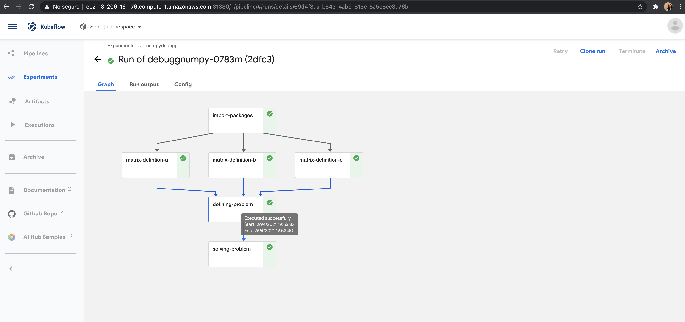
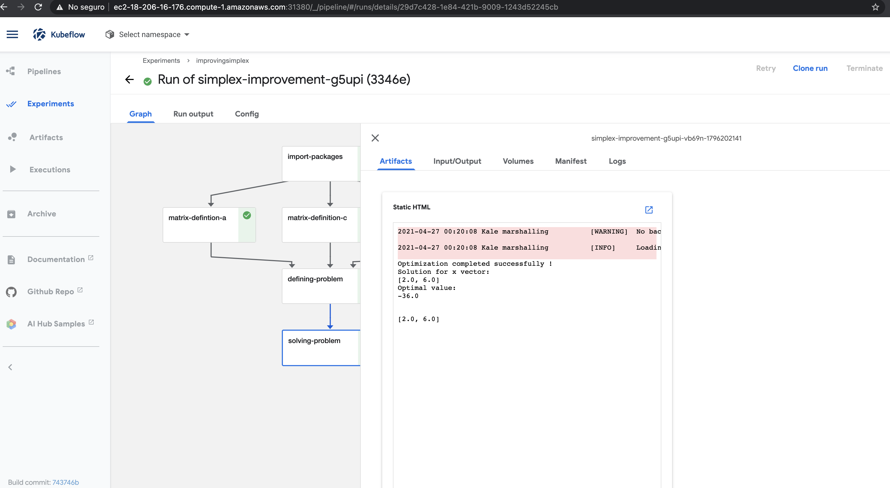
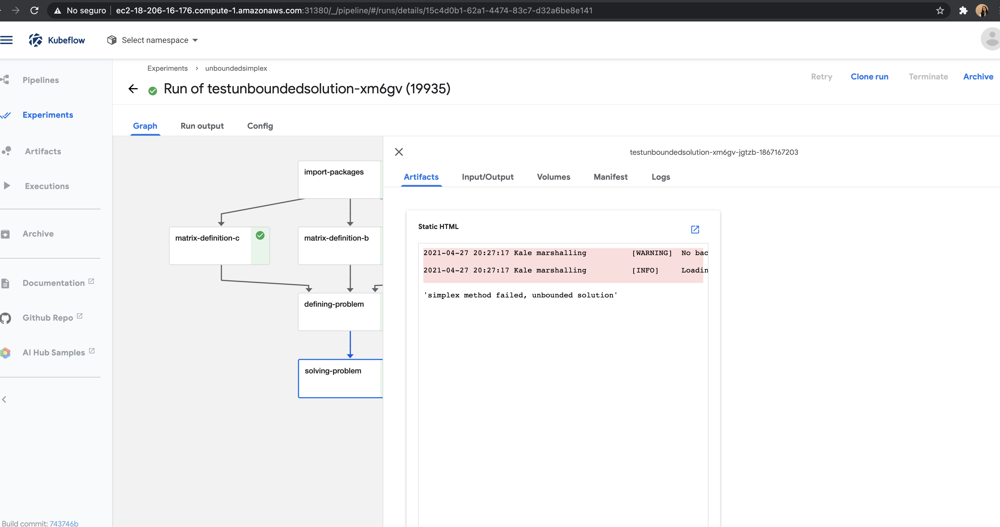

# Practica 2, parte 1

| usuario   | Rol               | Persona      | Actividad   |
| --------- | ------------------| ------------|--------------|
| jreyesgar93|Programación     | José        | Pipeline Kale|
| yalidt    | Programación  | Yalidt      | Revisión del paquete|
| yefovar   | Programación  | Yedam          | Revisión del paquete|
| mfrubio   | Project Manager        | Fernanda    | Montar servicios|

## Paquete Simplex
Implementamos un paquete en Python que resuelve problemas de maximización de una función objetivo lineal con restricciones:

 

sujeto a:

 

con:

Usamos sphynx para documentar nuestro [paquete.](https://optimizacion-2-2021-1-gh-classroom.github.io/practica-1-segunda-parte-yefovar/Simplex.html#module-Simplexs)

En particular, se indicó que existen imágenes de docker que ayudan a utilizar el paquete (sin y con Kale) tal como se muestra en la siguiente imagen.

### Botón de binder 
Para consultar ejemplos de implementaciones usa el boton de binder y el notebook para realizar el *testing* es 3_parte_2_practica_1.ipynb

### Actualizacion y mejoras del paquete
Todas las actualizaciones y mejoras al código se realizaron en el repositorio [anterior.](https://github.com/optimizacion-2-2021-1-gh-classroom/practica-1-segunda-parte-yefovar) `optimizacion-2-2021-1-gh-classroom/practica-1-segunda-parte-yefovar`

### Historial de lanzamientos de kale
Para revisar la documentación de los lanzamientos se puede accesar al siguiente [reporte.](https://github.com/optimizacion-2-2021-1-gh-classroom/practica-2-primera-parte-yefovar/blob/main/lanzamientos_pipeline/Lanzamientos.ipynb) 

Se realizaron cinco lanzamientos, los cuales corresponden a lo siguiente:
1. Prueba Kale

2. Debugg algorithm

3. Mejoras al paquete

4. Solución Unbounded

5. Pipeline Práctica 1 LA Bike Share

